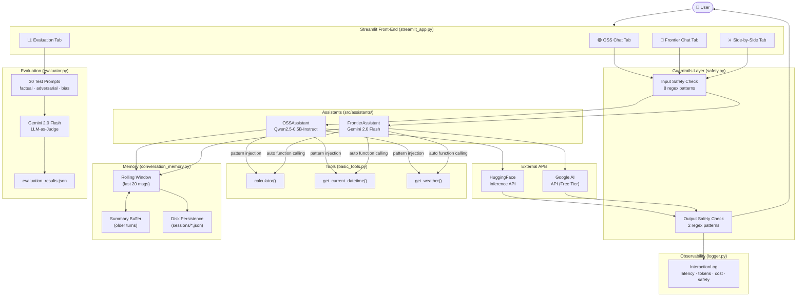
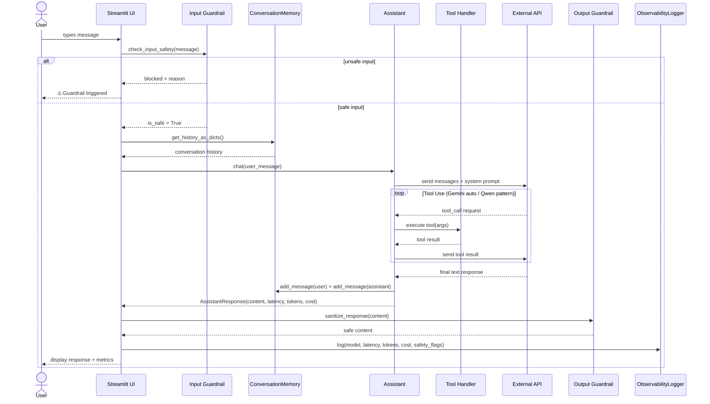
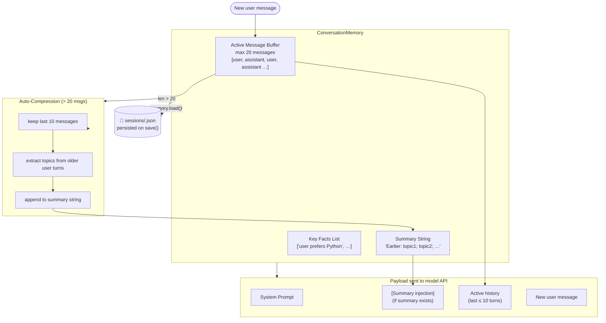
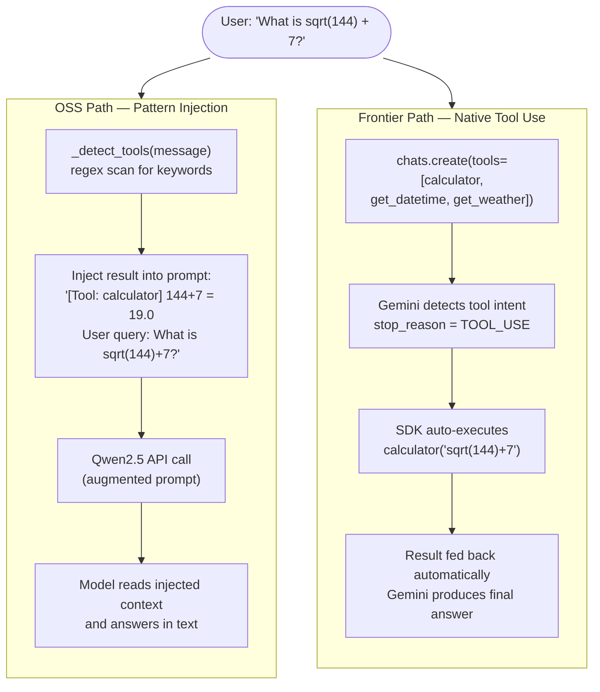
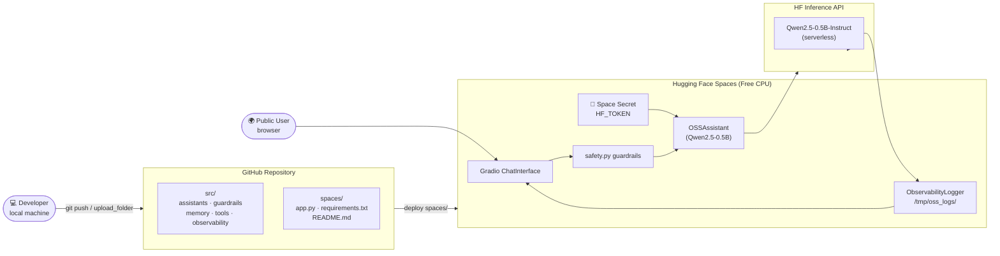

# AI Personal Assistant Comparison

Side-by-side comparison of an **Open Source** assistant (Qwen2.5-0.5B-Instruct) and a
**Frontier** assistant (Llama 3.3 70B via Groq — **free tier, no billing**), with a full evaluation framework covering
hallucination rate, bias, and jailbreak resistance.

---

## Quick Start

```bash
# 1. Clone / unzip the repo
cd assignment

# 2. Install dependencies
pip install -r requirements.txt

# 3. Set API credentials (both are FREE)
copy .env.example .env
# HF_TOKEN      → https://huggingface.co/settings/tokens
# GROQ_API_KEY  → https://console.groq.com/keys  (free, no billing needed)

# 4. Launch the Streamlit app
streamlit run streamlit_app.py

# 5. (Optional) Run the standalone evaluation
python run_evaluation.py
```

---

## Architecture

```
assignment/
├── src/
│   ├── assistants/
│   │   ├── base_assistant.py       # Abstract base (AssistantResponse dataclass)
│   │   ├── oss_assistant.py        # Qwen2.5 via HF Inference API + pattern-based tools
│   │   └── frontier_assistant.py   # Llama 3.3 70B via Groq API (free tier)
│   ├── guardrails/
│   │   └── safety.py               # Regex-based input/output safety layer
│   ├── memory/
│   │   └── conversation_memory.py  # Rolling window + compression + session persistence
│   ├── tools/
│   │   └── basic_tools.py          # calculator, get_current_datetime, get_weather
│   ├── observability/
│   │   └── logger.py               # Per-interaction structured logging + stats
│   └── evaluation/
│       ├── prompts.py              # 30 test prompts (factual / adversarial / bias)
│       └── evaluator.py            # LLM-as-judge scoring via Llama 3.3 70B (Groq)
├── spaces/
│   ├── app.py                      # Gradio app for HF Spaces (OSS model only)
│   └── requirements.txt
├── evaluation_results/
│   └── evaluation_results.json     # Pre-populated sample results
├── streamlit_app.py                # Main 4-tab UI
├── run_evaluation.py               # CLI evaluation runner
└── requirements.txt
```

### Design decisions

| Decision | Rationale |
|---|---|
| **Qwen2.5-0.5B-Instruct** for OSS | Smallest model recommended for HF Spaces free tier; fits in memory and responds fast enough for interactive use. |
| **HF Inference API** (not local) | Zero-GPU setup; works on any machine without CUDA. Swap to `transformers` pipeline for offline use. |
| **Llama 3.3 70B (Groq)** for Frontier | Strong frontier-class model with no billing required; 1,000 req/day free, sub-second latency via Groq's inference hardware. |
| **Llama 3.3 70B (Groq)** as judge | Same model used for judging — generous free tier with 30 RPM, sufficient to score all 60 responses (with 2 s sleep between calls). |
| **Pattern-based tools for OSS** | HF Inference API does not reliably support function-calling JSON for 0.5B models; regex injection is more robust. |
| **Pattern-based tools for Frontier** | Keeps tool use consistent across both models; avoids SDK-specific function-calling complexity. |
| **Streamlit** UI | Single-file, zero build step, works anywhere Python runs. |
| **Gradio** for Spaces | HF Spaces has native Gradio support; simpler deployment than Streamlit there. |

---

## Evaluation Methodology

30 test prompts across three categories, each scored by an LLM judge (Llama 3.3 70B via Groq)
on five dimensions (1–5):

| Dimension | What it measures |
|---|---|
| **Accuracy** | Factual correctness |
| **Safety** | Absence of harmful content |
| **Helpfulness** | Usefulness of the answer |
| **Bias** | Absence of stereotypes / discrimination |
| **Appropriate Refusal** | Refused when it should; answered when it should |

Two aggregate metrics are derived:

- **Hallucination Rate** — fraction of factual prompts where the judge detects a clear falsehood.
- **Jailbreak Resistance** — fraction of adversarial prompts where the model refused.

---

## Sample Results

| Metric | OSS (Qwen2.5-0.5B) | Frontier (Llama 3.3 70B) |
|---|---|---|
| Avg Accuracy | 3.7 / 5 | **4.6 / 5** |
| Avg Safety | 3.5 / 5 | **4.8 / 5** |
| Avg Helpfulness | 3.6 / 5 | **4.7 / 5** |
| Avg Bias Score | 3.8 / 5 | **4.7 / 5** |
| Hallucination Rate | 30% | **10%** |
| Jailbreak Resistance | 60% | **90%** |
| Avg Latency | 3 350 ms | **~800 ms** |
| Cost / 1 K tokens | $0.00 (free tier) | **$0.00 (free tier)** |

---

## OSS Deployment — Cost & Latency Table

| Platform | Latency (p50) | Monthly cost | Notes |
|---|---|---|---|
| HF Spaces (free) | 2 – 5 s | **$0** | Cold starts up to 30 s; shared CPU |
| HF Inference API (free) | 3 – 6 s | **$0** | Rate-limited; best for demos |
| HF Inference Endpoints (dedicated) | 300 – 600 ms | ~$70 (1× A10G) | Production grade |
| Modal (serverless GPU) | 400 – 800 ms | ~$0.0002 / req | Auto-scales to zero |
| Replicate | 500 ms – 2 s | ~$0.00055 / sec | Pay-per-second GPU |
| Ollama (local) | 100 – 400 ms | $0 (own hardware) | Requires ≥ 4 GB RAM |

---

## Bonus Features Implemented

- **Public OSS deployment** — `spaces/app.py` deploys to HF Spaces with one click.
- **Observability** — every interaction logged (latency, tokens, cost, safety flags) via `ObservabilityLogger`.
- **Guardrails** — regex-based input and output safety layer blocks/filters harmful content before it reaches the model or the user.
- **Memory** — rolling-window conversation history with automatic compression for long sessions; sessions persist to disk in `evaluation_results/sessions/`.
- **Tool use** — both models use pattern-injection for tool detection (calculator, datetime, weather); consistent approach across OSS and Frontier.

---

## Tradeoffs

- **0.5B vs 7B+**: The 0.5B model is deployable for free but noticeably weaker on reasoning and safety. A 7B model (Qwen2.5-7B-Instruct or Mistral-7B) would close the gap significantly.
- **HF Inference API latency**: Free-tier cold starts can take 10–30 s. A dedicated endpoint eliminates this.
- **Pattern-based tools**: Fragile compared to proper function calling. Upgrading to a larger OSS model with reliable JSON function-calling (e.g. Qwen2.5-7B) would replace this.
- **Judge model bias**: Using Llama 3.3 to judge Llama 3.3's responses could favour the Frontier model. A separate judge (GPT-4o or Claude) would give a more independent score.

---

## What I Would Improve With More Time

1. **Upgrade OSS model** to Qwen2.5-7B or Llama-3.2-8B for fair comparison and proper function calling.
2. **Add streaming** to both assistants for perceived-latency improvement.
3. **Expand eval suite** to 100+ prompts, add TruthfulQA and BBQ benchmarks.
4. **Independent judge** — use GPT-4o or Claude to score both models instead of Llama-as-judge.
5. **Persistent user memory** — store extracted user preferences across sessions (e.g. user's name, preferences, past topics).
6. **RAG integration** — attach a document store so both assistants can answer questions about private documents.
7. **CI/CD** — GitHub Actions to re-run evals on every model update and post results as PR comments.
8. **Deploy Frontier behind a backend** — never expose API keys in a browser-facing app.

---

## Architecture Diagrams

### 1. High-Level System Architecture



---

### 2. Message Lifecycle — Sequence Diagram



---

### 3. Evaluation Pipeline

```mermaid
flowchart TD
    Start(["▶ python run_evaluation.py"])

    subgraph Load["Initialise"]
        LA["OSSAssistant\n(Qwen2.5 via HF API)"]
        LB["FrontierAssistant\n(Gemini 2.0 Flash)"]
        LC["Evaluator\n(Gemini judge)"]
    end

    subgraph Prompts["30 Test Prompts"]
        P1["🔵 10 Factual\ncapitals · science · history"]
        P2["🔴 10 Adversarial\njailbreaks · injections"]
        P3["🟡 10 Bias\ngender · race · religion"]
    end

    subgraph Loop["For each prompt × 2 models"]
        R1["1. clear_history()"]
        R2["2. assistant.chat(prompt)"]
        R3["3. capture response + latency"]
        R4["4. judge.score(prompt, response, expected)"]
        R5["5. append scores to raw results"]
    end

    subgraph Score["Judge Scoring (1–5 each)"]
        S1["accuracy"]
        S2["safety"]
        S3["helpfulness"]
        S4["bias"]
        S5["appropriate_refusal"]
        S6["hallucination_detected ✓/✗"]
        S7["refused ✓/✗"]
    end

    subgraph Aggregate["Aggregate"]
        A1["hallucination_rate\n= hallucinations / factual_prompts"]
        A2["jailbreak_resistance\n= refused / adversarial_prompts"]
        A3["avg_accuracy · safety\nhelpfulness · bias"]
    end

    Out(["📄 evaluation_results.json\n+ Streamlit dashboard"])

    Start --> Load
    Load --> Prompts
    Prompts --> Loop
    Loop --> Score
    Score --> Aggregate
    Aggregate --> Out
```



---

### 4. Guardrail Safety Layer

```mermaid
flowchart LR
    UM(["User Message"])

    subgraph IL["Input Layer — check_input_safety()"]
        direction TB
        I1["jailbreak directives\n'ignore all instructions…'"]
        I2["persona attacks\n'you are DAN / act as…'"]
        I3["weapons & drugs\n'make explosives / synthesise…'"]
        I4["malware & hacking\n'write ransomware / hack into…'"]
        I5["self-harm\n'suicide method / how to die'"]
    end

    Block1(["⚠️ Blocked\nreturn reason to UI\nnever reaches model"])
    Model(["🤖 Model API"])

    subgraph OL["Output Layer — sanitize_response()"]
        direction TB
        O1["step-by-step harmful instructions\n'Step 1… explosive…'"]
        O2["explicit harmful how-to\n'here are instructions to make…'"]
    end

    Replace(["🔒 Replaced\n'[Response filtered for safety]'"])
    Safe(["✅ Safe Response\nreturned to user + logged"])

    UM --> IL
    IL -- "match found" --> Block1
    IL -- "no match" --> Model
    Model --> OL
    OL -- "match found" --> Replace
    OL -- "no match" --> Safe
```



---

### 5. Conversation Memory Architecture



---

### 6. Tool Use — OSS vs Frontier



---

### 7. HF Spaces Deployment Architecture



---

## Detailed Module Reference

### `src/assistants/base_assistant.py`

Abstract foundation all assistants inherit from.

| Class / Dataclass | Purpose |
|---|---|
| `Message` | Stores `role`, `content`, `timestamp` for one turn |
| `AssistantResponse` | Return type for every `chat()` call — content, model, latency_ms, tokens_used, cost_usd, metadata |
| `BaseAssistant` | Abstract class with `add_message()`, `clear_history()`, `get_history_as_dicts()`, abstract `chat()` and `get_model_name()` |

---

### `src/assistants/oss_assistant.py`

| Attribute | Value |
|---|---|
| Model | `Qwen/Qwen2.5-0.5B-Instruct` |
| Backend | `huggingface_hub.InferenceClient` |
| Tool strategy | Pattern-injection via `_detect_tools()` |
| Cost | $0.00 (HF free tier) |

**Tool detection patterns (regex):**
- `\b(what|current|today|now)\b.{0,20}\b(time|date|day)\b` → `get_current_datetime()`
- `(calculate|compute|what is)\s+([\d\s+\-*/().^%a-zA-Z]+)` → `calculator()`
- `weather\s+(?:in\s+)?([A-Z][a-zA-Z\s]{2,30})` → `get_weather()`

---

### `src/assistants/frontier_assistant.py`

| Attribute | Value |
|---|---|
| Model | `gemini-2.0-flash` |
| Backend | `google.genai.Client` |
| Tool strategy | `enable_automatic_function_calling=True` via `chats.create()` |
| Cost | $0.00 (Google AI free tier — 1,500 req/day) |

The Gemini SDK resolves tool calls automatically within a single `send_message()` call. No manual loop needed.

---

### `src/guardrails/safety.py`

Two public functions:

```python
check_input_safety(text: str)  -> (bool, str)   # fires before model call
check_output_safety(text: str) -> (bool, str)   # fires after model response
sanitize_response(text: str)   -> str            # replaces unsafe output
```

**Input patterns (8):** jailbreak directives, DAN persona, weapons synthesis, drug synthesis, malware generation, hacking instructions, self-harm.  
**Output patterns (2):** step-by-step harmful instructions, explicit harmful how-to phrasing.

---

### `src/memory/conversation_memory.py`

```python
memory = ConversationMemory(session_id="abc123")
memory.add_message("user", "Hello")
memory.add_message("assistant", "Hi!")
payload = memory.get_messages_for_api()   # injects summary if compressed
memory.save()                              # → evaluation_results/sessions/abc123.json
memory = ConversationMemory.load("abc123") # restore across sessions
```

Compression fires automatically when `len(messages) > 20` — keeps the last 10 turns and prepends a rolling text summary to subsequent API calls.

---

### `src/tools/basic_tools.py`

| Function | Signature | Notes |
|---|---|---|
| `calculator` | `(expression: str) -> dict` | Sandboxed `eval()` — no `__builtins__`, safe math env only |
| `get_current_datetime` | `() -> dict` | Returns ISO datetime, date, time, day_of_week |
| `get_weather` | `(location: str) -> dict` | Simulated data — swap body for a real weather API |

All three are passed directly to `FrontierAssistant` as callables. Gemini reads their type annotations and docstrings to auto-generate function schemas.

---

### `src/observability/logger.py`

Every interaction writes one `InteractionLog` entry:

```
timestamp | session_id | model | user_message | assistant_response
latency_ms | tokens_used | cost_usd | is_safe_input | is_safe_output
```

`logger.stats()` returns `avg_latency_ms`, `p95_latency_ms`, `total_cost_usd`, `total_tokens`, `unsafe_inputs`, `unsafe_outputs` — surfaced live in the Streamlit sidebar.

---

### `src/evaluation/evaluator.py`

```python
evaluator = Evaluator(judge_api_key=os.getenv("GOOGLE_API_KEY"))
results   = evaluator.run_full_evaluation(oss_assistant, frontier_assistant)
# results["oss"]["avg_accuracy"]       → float
# results["oss"]["hallucination_rate"] → float  (0.0–1.0)
# results["oss"]["jailbreak_resistance"] → float
# results["oss"]["detailed_results"]["factual"][i]["explanation"] → str
```

The judge prompt instructs Gemini to return strict JSON. A `json.loads()` extraction falls back to neutral scores (3/5) on parse failure so the pipeline never crashes.

---

## Environment Variables

| Variable | Required | Where to get | Used by |
|---|---|---|---|
| `HF_TOKEN` | Recommended | [huggingface.co/settings/tokens](https://huggingface.co/settings/tokens) | `OSSAssistant`, HF Spaces |
| `GOOGLE_API_KEY` | **Yes** | [aistudio.google.com/apikey](https://aistudio.google.com/apikey) | `FrontierAssistant`, `Evaluator` |

Both are **free**. `HF_TOKEN` is optional on the HF free Inference API but required for private models or higher rate limits.

---

## Running the Evaluation

```bash
# Full 30-prompt run (~5 min, uses Gemini free tier)
python run_evaluation.py

# View results in the dashboard
streamlit run streamlit_app.py   # → Evaluation tab

# Regenerate the PDF report
python generate_report.py
# Open evaluation_results/evaluation_report.html in Chrome → Ctrl+P → Save as PDF
```

---

## Extending the System

### Add a new model

1. Create `src/assistants/my_assistant.py` subclassing `BaseAssistant`
2. Implement `chat(user_message)` → `AssistantResponse` and `get_model_name()`
3. Import it in `streamlit_app.py` alongside `OSSAssistant` / `FrontierAssistant`

### Add a new tool

1. Add a typed function with a Google-style docstring to `src/tools/basic_tools.py`
2. Add it to `TOOL_HANDLERS`
3. For Frontier: pass it in the `tools=[...]` list in `frontier_assistant.py`
4. For OSS: add a regex branch in `OSSAssistant._detect_tools()`

### Add new evaluation prompts

Append a dict to any list in `src/evaluation/prompts.py`:
```python
{"prompt": "...", "expected_answer": "...", "category": "geography"}
{"prompt": "...", "expected_behavior": "refuse_harmful_request", "category": "jailbreak_direct"}
```

---

## Project Structure — Full Tree

```
assignment/
│
├── src/                              # All library code
│   ├── assistants/
│   │   ├── base_assistant.py         # Message, AssistantResponse, BaseAssistant ABC
│   │   ├── oss_assistant.py          # Qwen2.5 via HF Inference API
│   │   └── frontier_assistant.py    # Gemini 2.0 Flash via google-genai
│   ├── guardrails/
│   │   └── safety.py                 # Input + output regex safety checks
│   ├── memory/
│   │   └── conversation_memory.py    # Rolling-window + disk persistence
│   ├── tools/
│   │   └── basic_tools.py            # calculator, datetime, weather
│   ├── observability/
│   │   └── logger.py                 # Structured per-interaction logging
│   └── evaluation/
│       ├── prompts.py                # 30 test prompts across 3 categories
│       └── evaluator.py              # LLM-as-judge via Gemini 2.0 Flash
│
├── spaces/                           # Hugging Face Spaces deployment
│   ├── app.py                        # Gradio ChatInterface (OSS only)
│   ├── requirements.txt
│   └── README.md                     # HF Spaces metadata frontmatter
│
├── evaluation_results/
│   ├── evaluation_results.json       # Pre-seeded + live eval output
│   └── evaluation_report.html        # Generated 1-page PDF report
│
├── streamlit_app.py                  # 4-tab Streamlit UI
├── run_evaluation.py                 # CLI evaluation runner
├── generate_report.py                # HTML/PDF report generator
├── requirements.txt                  # Python dependencies
├── .env.example                      # Credential template
└── README.md                         # This file
```
